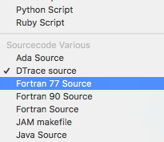

D语言
创建脚本文件syscall.d
跟可执行文件每次进入每个系统调用时的可执行文件名称：
```shell
$ vi syscall.d
```
输入脚本：
```shell
#!/usr/sbin/dtrace -s  #解释器调用行
syscall:::entry
{
  trace(execname);
}
```
执行脚本文件：
```shell
$ sudo dtrace -s syscall.d
CPU     ID                    FUNCTION:NAME
  3    264                      ioctl:entry   dtrace                           
  3    264                      ioctl:entry   dtrace                           
  0    560                     sysctl:entry   dtrace  
```

## 创建OC头文件 
将脚本文件添加到xcode构建目标target中  
1. 确保将类型设置为`DTrace source`。

Xcode现在会在构建时自动创建一个对应的`syscall.h`头文件。
xcode执行的相关命令：
```shell
dtrace -h -s syscall.d
```
这样将`syscall.d`加入到xcode工程和相应的构建目标，显的尤为重要。

`syscall.h`头文件出现在DERIVED_FILE_DIR中。在OC代码中导入源文件：
```objc
#import "syscall.h"
```
Xcode有一个内置的`build rule`来处理DTrace提供者的描述。

## 包装DTrace探针


